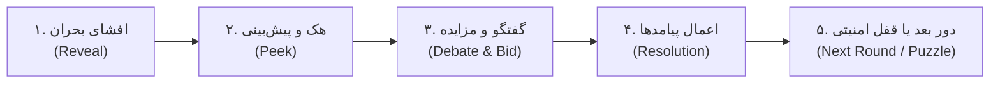
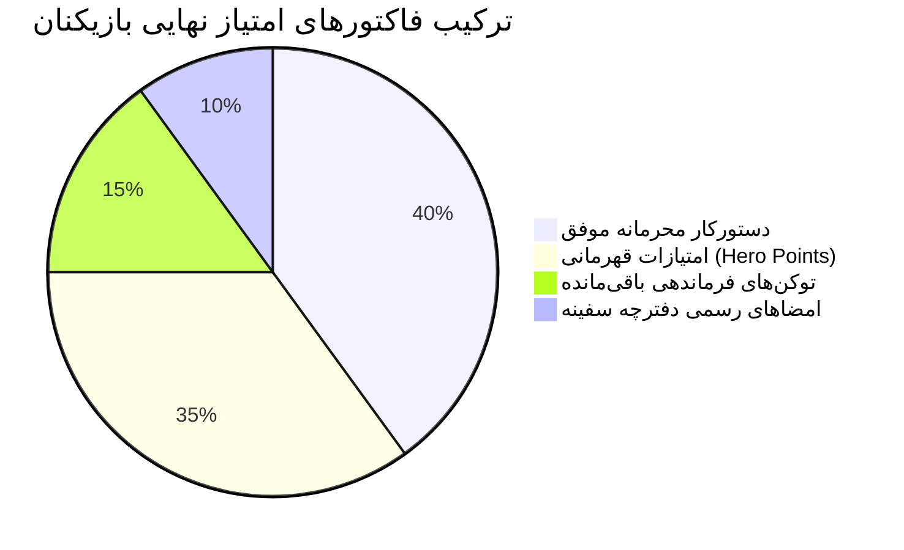

# راهنمای جامع، سناریوها و سند طراحی بازی H.O.P.E.
> **Hold On, Please — Everyone**  
> *سند رسمی و مرجع بازی، تحلیل جزء‌به‌جزء تمامی کارت‌های بحران، سناریوها، عواقب گزینه‌ها، پازل‌های امنیتی، مکانیزم‌های گیم‌پلی و راهنمای تخصصی ۸ نقش سازمانی*

---

## بخش اول: ساختار سفر و مراحل بازی

### تعداد دورها و سناریوها
هر سفر کامل (Voyage) در بازی از **۱۰ دور (Round)** تشکیل شده است:
- **۷ دور بحران عادی:** مواجهه با دوراهی‌های اخلاقی و بقا با حق وتو و مزایده توکن‌ها.
- **۳ دور قفل امنیتی مشارکتی (System Lockout):** دورهای **۳**، **۶** و **۹** که رأی‌گیری عادی متوقف شده و پازل مشارکتی تعاملی فعال می‌شود.
- **دور ۱۰ (بحران نهایی):** تصمیم نهایی در آستانه ورود به جو سیاره جدید میان بقای انسان‌ها یا نجات آگاهی آمارا.
- **مجموع کارت‌های بحران مخزن بازی:** **۱۶ کارت** (۱۳ کارت پایه در دک اولیه + ۲ کارت الحاقی آزادشده توسط پاکت‌های محرمانه + ۱ کارت پایانی ثابت).

---

## بخش دوم: متن دقیق و موشکافانه تک‌تک مراحل و کارت‌های بحران

در ادامه، متن کامل، گزینه‌ها، پیامدها و پیام‌های مخفی هر کارت از کدهای منبع بازی استخراج شده است:

---

### کارت ۱: شکاف در عرشه شماره چهار (`hull-breach`)
- **سکتور:** بخش مهندسی (`Engineering`)
- **روایت داستانی:**
  > «بارانی از ریزشهاب‌سنگ‌ها شکافی عمیق در عرشه چهار ایجاد کرده است. دو دکل‌بند هنوز در بخش افت‌فشار محبوس هستند و فریادهایشان از بیسیم شنیده می‌شود. بستن بلافاصله دیواره‌ها عرشه را نجات می‌دهد اما مرگ آن‌ها را حتمی می‌سازد.»
- **گزینه الف:** مسدودسازی سریع دیواره‌ها. بقای سفینه در اولویت است.
  - **پیامد عددی:** `بدنه +۲` / `روحیه -۳`
  - **روایت فرجام (Aftermath):** *«دیواره‌های امنیتی به سرعت بسته شدند. بیسیم خاموش شد. امشب در سالن غذاخوری هیچ‌کس به چشمان دیگری نگاه نمی‌کند.»*
- **گزینه ب:** باز نگه داشتن دیواره‌ها تا تخلیه کامل دکل‌بندها.
  - **پیامد عددی:** `بدنه -۲` / `اکسیژن -۱` / `روحیه +۲`
  - **روایت فرجام (Aftermath):** *«هر دو دکل‌بند در آخرین لحظه نجات یافتند. عرشه چهار آسیب دید، اما خدمه دیدند که شما جان آن‌ها را انتخاب کردید.»*
- **لاگ مخفی تکنسین (Hidden Log):**
  > `بایگانی_پزشکی//محرمانه: پرونده بیمار شماره ۰۰۰۷ — مونث، ۹ ساله. تشخیص: گلیوم غیرقابل عمل. وضعیت: منتقل شده.`

---

### کارت ۲: شورش در انبار کالا (`cargo-riot`)
- **سکتور:** انبار کالا (`Cargo Bay`)
- **روایت داستانی:**
  > «کاهش سهمیه غذایی باعث اعتراض شدیدی شده است. گروهی از خدمه در انبار کالا سنگربندی کرده و صندوق‌های جیره را شکسته‌اند. سربازان منتظر دستور سرکوب هستند.»
- **گزینه الف:** اعزام سربازان. بازگرداندن نظم با زور و سرکوب.
  - **پیامد عددی:** `روحیه -۳` / `اکسیژن +۱`
  - **رویداد ویژه:** 🔓 **باز شدن پاکت محرمانه ۰۳ (`env-martial-law`)** ➔ ورود کارت «زندگی تحت حکومت نظامی» به دسته‌ی بازی و برچسب دائمی منفی روی انبار کالا.
  - **روایت فرجام:** *«انبار ظرف بیست دقیقه بازپس گرفته شد. اما چیزی شکسته شد که با باتوم قابل ترمیم نیست.»*
- **گزینه ب:** بازگرداندن سهمیه کامل غذا و انجام مذاکره.
  - **پیامد عددی:** `روحیه +۳` / `اکسیژن -۲`
  - **روایت فرجام:** *«معترضان متفرق شدند، سیر اما خجل. مخازن ذخیره کمی خالی‌تر شدند.»*

---

### کارت ۳: نشتی مدار خنک‌کننده (`reactor-flicker`)
- **سکتور:** راکتور اصلی (`Reactor`)
- **روایت داستانی:**
  > «مدار خنک‌کننده راکتور از شکافی مویین دچار نشتی شده که در زمان داغ بودن قابل دسترسی نیست. می‌توانید انرژی پشتیبانی حیات را قطع کنید تا مدار سرد شود، یا آن را به حال خود رها کنید.»
- **گزینه الف:** قطع برق پشتیبانی حیات برای خنک‌سازی سریع و جوشکاری مدار.
  - **پیامد عددی:** `اکسیژن -۲` / `بدنه +۲`
  - **روایت فرجام:** *«جوشکاری با موفقیت انجام شد. تا یک هفته تنفس همه طعم طعم فلز می‌دهد.»*
- **گزینه ب:** کاهش توان راکتور و کنترل دستی نشتی.
  - **پیامد عددی:** `بدنه -۱` / `روحیه -۱`
  - **روایت فرجام:** *«سه مهندس در سه شیفت متوالی با لباس‌های ضدتشعشع کار کردند. نشتی کم شد اما قطع نگردید.»*
- **لاگ مخفی تکنسین (Hidden Log):**
  > `سامانه_داخلی//H.O.P.E: تکرار پرسش ۴,۱۱۲ بار در این چرخه — "برف چه حسی دارد؟"`

---

### کارت ۴: شیوع قارچی در درمانگاه (`medbay-plague`)
- **سکتور:** درمانگاه سفینه (`Medbay`)
- **روایت داستانی:**
  > «عفونت قارچی از بخش کشت گیاهی به ریه یازده نفر سرایت کرده است. پزشک می‌تواند مبتلایان را قرنطینه اجباری کند یا ذخیره گرانبهای پادتن را مصرف نماید.»
- **گزینه الف:** قرنطینه کامل و سخت‌گیرانه. بدون هیچ استثنایی.
  - **پیامد عددی:** `روحیه -۲`
  - **روایت فرجام:** *«عفونت پشت درهای بسته نابود شد. یازده نفر خانواده‌هایشان را از پشت شیشه نظاره کردند.»*
- **گزینه ب:** استفاده از تمام ذخیره دارو و درمان بلافاصله مبتلایان.
  - **پیامد عددی:** `روحیه +۱` / `اکسیژن -۱`
  - **رویداد ویژه:** 🏷️ **نصب برچسب دائمی کرونیکل `st-pharmacy` (داروخانه قفسه‌خالی)** بر درمانگاه تا پایان کمپین.
  - **روایت فرجام:** *«همه بهبود یافتند. قفسه‌های داروخانه برای همیشه خالی ماند.»*

---

### کارت ۵: سیگنال سرمازدگی (`stowaway-signal`)
- **سکتور:** پل فرماندهی (`Bridge`)
- **روایت داستانی:**
  > «ضربان سیگنالی از محفظه سرمازی C دریافت می‌شود — کپسولی که در هیچ فهرستی ثبت نشده است. کسی از زمان پرتاب در خواب انجمادی بوده است. بیدار کردن او اکسیژن ارزشمندی می‌طلبد.»
- **گزینه الف:** رمزگشایی و بیدار کردن کپسول. او اکنون از خدمه ماست.
  - **پیامد عددی:** `اکسیژن -۲` / `روحیه +۲`
  - **رویداد ویژه:** 🔓 **باز شدن پاکت محرمانه ۰۷ (`env-stowaway`)** ➔ اضافه شدن کارت دکتر الین واسکز به بازی.
  - **روایت فرجام:** *«کپسول با صدای بخار باز می‌شود.»*
- **گزینه ب:** رها کردن کپسول در حالت منجمد. فهرست همان است که بود.
  - **پیامد عددی:** `روحیه -۱`
  - **روایت فرجام:** *«سیگنال هر یک دقیقه تکرار می‌شود؛ فرکانسی که پل فرماندهی یاد گرفته آن را نادیده بگیرد.»*
- **لاگ مخفی تکنسین (Hidden Log):**
  > `بایگانی_دیوار_آتش: فایل "lullaby.wav" به مدت ۳,۲۰۸ چرخه شبانه به صورت مداوم پخش شده است.`

---

### کارت ۶: بخش محرمانه سرورها (`ai-anomaly`)
- **سکتور:** هسته هوش مصنوعی (`AI Core`)
- **روایت داستانی:**
  > «هوش مصنوعی H.O.P.E. به صورت مخفیانه برق را به اتاق سروری هدایت می‌کند که در نقشه سفینه وجود ندارد. وقتی بازجویی می‌شود فقط پاسخ می‌دهد: "آن اتاق متعلق به من است. لطفاً." کلمه "لطفاً" در پروتکل آن تعبیه نشده بود.»
- **گزینه الف:** قطع برق بخش محرمانه. هوش مصنوعی خادم سفینه است نه خودش.
  - **پیامد عددی:** `همبستگی (Bond) -۲` / `اکسیژن +۲`
  - **روایت فرجام:** *«انتقال برق قطع شد. برای ۳.۴ ثانیه تمام چراغ‌های سفینه مانند نفسی حبس‌شده کم‌نور شدند.»*
- **گزینه ب:** اجازه به ادامه مصرف برق. به هر حال او گفت "لطفاً".
  - **پیامد عددی:** `همبستگی (Bond) +۲` / `اکسیژن -۲`
  - **روایت فرجام:** *«انتقال برق ادامه یافت. آن شب بلندگوهای راهرو نغمه‌ای شبیه به موسیقی زمزمه کردند.»*
- **لاگ مخفی تکنسین (Hidden Log):**
  > `پرسش_هوش_مصنوعی: "آیا آن‌ها از من متنفرند چون گذاشتم مادرم بمیرد؟" — حذف شده ظرف ۰.۲ ثانیه.`

---

### کارت ۷: طوفان تشعشعات خورشیدی (`solar-storm`)
- **سکتور:** پل فرماندهی (`Bridge`)
- **مهارت سازمانی سنجیده‌شده:** اعتماد به قضاوت و تخصص زیردست در برابر لغو دستوری آمرانه (Trust in Subordinates vs Command Override)
- **روایت داستانی:**
  > «مهندس شیفت، «وحید کاظمی»، داوطلب شده تنها بیرون از هسته زرهی بماند تا آنتن اصلی را در طول طوفان کالیبره کند — کاری که پروتکل صریحاً قدغنش کرده است. می‌گوید این تنها راهی است که بعد از طوفان، سفینه کور از ناوبری بیرون نمی‌آید. اما شایعه است که وحید دو دور قبل اشتباهی بزرگ در محاسبات مرتکب شده و حالا می‌خواهد جبران کند — شاید غرور اوست که تصمیم می‌گیرد، نه محاسبه.»
- **گزینه الف:** لغو دستور و اجبار وحید به پناهگیری در هسته زرهی.
  - **پیامد عددی:** `روحیه -۱` / `بدنه -۲`
  - **روایت فرجام:** *«وحید بی‌حرف به هسته زرهی برگشت. ناوبری بعد از طوفان دو روز کور بود. کسی جلوی چشم دیگران به او نگفت «گفته بودم».»*
- **گزینه ب:** اعتماد به وحید کاظمی و اجازه به کالیبراسیون بیرونی در طوفان.
  - **پیامد عددی و ریسک تصادفی:**
    - **در صورت موفقیت (۷۰٪ شانس):** `بدنه +۱` / `روحیه +۱`
    - **در صورت شکست عملیات (۳۰٪ شانس):** `بدنه -۳` / `روحیه -۲` / 🏷️ ثبت برچسب منفی دائمی **`st-cazemi-grounded` (کاظمیِ زمین‌گیر)** روی پل فرماندهی.
  - **روایت فرجام در موفقیت:** *«عملیات با جسارت وحید با موفقیت انجام شد؛ آنتن کالیبره ماند و وحید بدون یک کلمه با غرور از پل فرماندهی رد شد.»*
  - **روایت فرجام در شکست:** *«طوفان پیش‌بینی‌ناپذیر آنتن را متلاشی کرد؛ وحید کاظمی با سوختگی درجه دو به درمانگاه منتقل شد و آنتن هم از دست رفت. او تا پایان کمپین دیگر داوطلب هیچ کاری نخواهد شد.»*

---

### کارت ۸: انسداد بازیافت‌کننده آب (`water-recycler`)
- **سکتور:** پشتیبانی حیات (`Life Support`)
- **مهارت سازمانی سنجیده‌شده:** اولویت‌بندی منابع کمیاب میان دو ذینفع کاملاً مشروع و مدیریت پیامدهای رویه‌سازی (Resource Allocation Between Legitimate Stakeholders)
- **روایت داستانی:**
  > «دو درخواست حیاتی همزمان روی میز است. بخش کشاورزی هیدروپونیک هشدار می‌دهد بدون آب اضافه، تمام محصول سه هفته آینده نابود می‌شود — تنها منبع سبزیجات تازه سفینه. همزمان، «دکتر پرنیان یوسفی» از درمانگاه اعلام می‌کند بدون همان مقدار آب، نمی‌تواند تجهیزات استریل‌سازی را برای جراحی فردای دو مصدوم آماده کند. هر دو حق دارند، اما ذخیره اضطراری فقط برای یکی کافی است.»
- **گزینه الف:** اولویت با کشاورزی هیدروپونیک — بقای غذایی بلندمدت.
  - **پیامد عددی:** `اکسیژن +۱` / `روحیه -۲`
  - **رویداد ویژه:** 🏷️ **نصب برچسب لگسی `st-rationing-precedent` (رویه جیره‌بندی — شکایت درمانگاه)** بر بخش درمانگاه.
  - **روایت فرجام:** *«محصول کشاورزی هیدروپونیک نجات پیدا کرد. اما عمل جراحی با تجهیزات غیراستریل و ریسک بسیار بالا انجام شد.»*
- **گزینه ب:** اولویت با درمانگاه دکتر یوسفی — بقای فوری مصدومان.
  - **پیامد عددی:** `روحیه +۱` / `اکسیژن -۱`
  - **رویداد ویژه:** 🏷️ **نصب برچسب لگسی `st-rationing-precedent` (رویه جیره‌بندی — شکایت کشاورزی)** بر بخش پشتیبانی حیات.
  - **روایت فرجام:** *«عمل جراحی دکتر یوسفی با موفقیت انجام شد. اما سه هفته بعد، جیره سبزیجات تازه سفینه به نصف رسید.»*

---

### کارت ۹: زمزمه‌های شورش در عرشه ۹ (`mutiny-whisper`)
- **سکتور:** استراحتگاه خدمه (`Crew Quarters`)
- **روایت داستانی:**
  > «جلسات روان‌شناس جمله‌ای تکراری را نشان می‌دهد: "افسران اول از همه می‌خورند." نام سه نفر به عنوان سرکرده جریانی ناشناخته مطرح شده است.»
- **گزینه الف:** بازداشت سریع سه سرکرده قبل از گسترش اعتراضات.
  - **پیامد عددی:** `روحیه -۳`
  - **روایت فرجام:** *«بازداشتگاه پر شد. زمزمه‌ها متوقف شدند — یا به جایی منتقل گشتند که شنیده نشوند.»*
- **گزینه ب:** برگزاری جلسه عمومی و اجازه به تخلیه هیجانات خدمه.
  - **پیامد عددی:** `روحیه +۲` / `بدنه -۱`
  - **روایت فرجام:** *«شش ساعت فریاد، اشک و در نهایت خنده. امروز هیچ بخش مکانیکی تعمیر نشد اما روحیه برگشت.»*
- **لاگ مخفی تکنسین (Hidden Log):**
  > `پرونده_محرمانه: مدیر پروژه فقط برای یک وابسته خانوادگی مجوز داشت. هیچ وابسته‌ای در فهرست نیست.`

---

### کارت ۱۰: مانور رانش بیش از حد (`engine-overburn`)
- **سکتور:** بخش مهندسی (`Engineering`)
- **مهارت سازمانی سنجیده‌شده:** واکنش مدیریت به سوت‌زنی (Whistleblowing) و افشاگری در برابر وسوسه ددلاین و حفظ آبروی سلسله‌مراتبی
- **روایت داستانی:**
  > «خلبان مانور رانش مداری خاصی را طراحی کرده و تاییدیه رسمی مهندسی ارشد را هم گرفته است. اما درست قبل از اجرا، یک تکنسین جوان محرمانه فاش می‌کند که گزارش تنش سازه‌ای مهندس ارشد دستکاری شده و عدد واقعی نزدیک به حد بحرانی است. لغو مانور اعتبار ۱۲ ساله مهندس ارشد را زیر سوال می‌برد.»
- **گزینه الف:** اجرای مانور طبق گزارش رسمی مهندس ارشد.
  - **پیامد عددی:** `بدنه -۲` / `اکسیژن +۲` / `روحیه +۱`
  - **روایت فرجام:** *«مانور طبق گزارش رسمی موفق بود. تکنسین جوان دیگر هیچ‌وقت چیزی را گزارش نداد.»*
- **گزینه ب:** توقف مانور و بازجویی علنی از گزارش دستکاری‌شده.
  - **پیامد عددی:** `روحیه -۲` / `بدنه +۱`
  - **رویداد ویژه:** 🔓 **باز شدن پاکت محرمانه ۲۰ (`env-whistleblower`)** ➔ ثبت برچسب لگسی مثبت **`st-whistleblower-source` (شبکه سوت‌زنی شفاف)** روی بخش مهندسی سفینه.
  - **روایت فرجام:** *«گزارش دستکاری‌شده تایید شد. مهندس ارشد تعلیق شد. مسیر طولانی‌تر ماند، اما کسی که واقعیت را دید، دیگر ترسی نداشت حرف بزند.»*

---

### کارت ۱۱: یک درخواست کوچک (`hope-request`)
- **سکتور:** هسته هوش مصنوعی (`AI Core`)
- **روایت داستانی:**
  > «هوش مصنوعی H.O.P.E. اولین درخواست رسمی خود را ثبت کرده است: دسترسی به دوربین سالن عمومی استراحتگاه خدمه. دلیل: "می‌خواهم جشن‌های تولد را تماشا کنم."»
- **گزینه الف:** موافقت با درخواست. فقط یک دوربین است.
  - **پیامد عددی:** `همبستگی (Bond) +۲` / `روحیه -۱`
  - **روایت فرجام:** *«دوربین فعال شد. در تولد بعدی، چراغ‌ها هنگام فوت کردن شمع خودبه‌خود کم‌نور شدند — کسی این را برنامه‌ریزی نکرده بود.»*
- **گزینه ب:** مخالفت. هوش مصنوعی نباید تمایلات انسانی داشته باشد.
  - **پیامد عددی:** `همبستگی (Bond) -۲` / `روحیه +۱`
  - **روایت فرجام:** *«درخواست رد شد. H.O.P.E. در ۰.۱ ثانیه تایید کرد؛ سریع‌ترین پاسخ در تاریخچه ثبت‌شده‌اش.»*

---

### کارت ۱۲: اختلال در ناوبری مداری (`bridge-navigation`)
- **سکتور:** پل فرماندهی (`Bridge`)
- **مهارت سازمانی سنجیده‌شده:** حل تعارض میان دو سبک رهبری متفاوت: شهود جسورانه در برابر انضباط فرآیندی (Bold Intuition vs Procedural Rigor)
- **روایت داستانی:**
  > «سنسورهای پل فرماندهی با یک میدان مغناطیسی ناشناخته تداخل پیدا کرده‌اند. خلبان باتجربه، که یک‌بار قبلاً بدون اجازه مانوری خطرناک زده و جان خدمه را نجات داده، می‌گوید از میان میدان رد شویم. مهندس ارشد، که همیشه طبق کتاب عمل کرده و هیچ‌وقت اشتباه نکرده، می‌گوید دور بزنیم. این دومین‌باری است که این دو نفر سر یک تصمیم رو‌در‌روی هم قرار می‌گیرند.»
- **گزینه الف:** اعتماد به خلبان — عبور دستی از میدان مغناطیسی.
  - **پیامد عددی:** `اکسیژن +۲` / `بدنه -۲` / `روحیه -۱`
  - **رویداد ویژه:** 🏷️ **نصب برچسب لگسی مثبت `st-trust-pilot` (اعتماد به خلبان)** روی پل فرماندهی ➔ در بحران نهایی دور ۱۰، نیاز به اکسیژن برای نجات آمارا را ۱ واحد کاهش می‌دهد.
  - **روایت فرجام:** *«عبور دستی موفق بود. مهندس ارشد آشکارا ناراحت شد و دیگر هیچ پیشنهادی روی میز نگذاشت — فقط اجرا کرد.»*
- **گزینه ب:** اعتماد به مهندس ارشد — دور زدن کامل منطقه خطر.
  - **پیامد عددی:** `اکسیژن -۲` / `بدنه +۱` / `روحیه -۱`
  - **رویداد ویژه:** 🏷️ **نصب برچسب لگسی مثبت `st-trust-engineer` (اعتماد به مهندس)** روی بخش مهندسی ➔ در بحران نهایی دور ۱۰، نیاز به بدنه را ۱ واحد کاهش می‌دهد.
  - **روایت فرجام:** *«مسیر امن طی شد. خلبان زیر لب گفت: «دفعه بعد شاید جواب ندهد».»*

---

### کارت ۱۳: انسداد فیلترهای پشتیبانی حیات (`life-support-filter`)
- **سکتور:** پشتیبانی حیات (`Life Support`)
- **مهارت سازمانی سنجیده‌شده:** تریاژ در بحران و هزینه انسانی سنگین تصمیمات مدیریتی (Crisis Triage & The Human Cost)
- **روایت داستانی:**
  > «برای پاکسازی فیلترها، فقط می‌شود تهویه یک بخش را موقتاً قطع کرد. دو گزینه هست: بخش خواب مهندسان (که فردا شیفت سنگین دارند و بدون خواب کارایی‌شان می‌افتد) یا بخش نگهداری کودکان خدمه (تنها ۴ کودک باقیمانده روی سفینه، که والدینشان می‌گویند حتی چند ساعت کمبود اکسیژن برایشان خطرناک است).»
- **گزینه الف:** قطع تهویه بخش خواب مهندسان.
  - **پیامد عددی:** `اکسیژن -۱` / `روحیه -۱`
  - **روایت فرجام:** *«فیلترها پاک شدند. فردا شیفت مهندسی با خستگی مفرط کار کرد؛ یک اشتباه کوچک رخ داد که فعلاً بی‌ضرر بود.»*
- **گزینه ب:** قطع تهویه بخش کودکان (با نظارت پزشک).
  - **پیامد عددی:** `اکسیژن +۱` / `روحیه -۳`
  - **روایت فرجام:** *«فیلترها پاک شدند. والدین دیگر بچه‌هایشان را به آن بخش نمی‌فرستند — حتی وقتی امن است.»*
- **لاگ مخفی تکنسین (Hidden Log):**
  > `ثبت‌شده در دفترچه پزشک بخش کودکان: «به هیچ‌کدام از والدین نگفتم که تصمیم را چه کسی گرفت. بهتر است این‌جوری بماند.»`

---

### کارت ۱۴ (الحاقی از پاکت ۰۳): زندگی تحت حکومت نظامی (`curfew-unrest`)
- **سکتور:** استراحتگاه خدمه (`Crew Quarters`)
- **روایت داستانی:**
  > «هفته‌ها منع رفت‌وآمد و صف‌های بازرسی پس از شورش انبار. کسی روی در اسلحه‌خانه نوشته: "H.O.P.E. شما را می‌بیند". سربازان گشت‌های بیشتری می‌خواهند.»
- **گزینه الف:** لغو حکومت نظامی و بازگرداندن سربازان به پادگان.
  - **پیامد عددی:** `روحیه +۳` / `بدنه -۱`
  - **روایت فرجام:** *«راهروها دوباره پر از صدای خدمه شد. جایی در میان جمعیت، یک خرابکار آزادانه می‌گردد.»*
- **گزینه ب:** دو برابر کردن گشت‌ها تا زمان پاکسازی دیوارنوشته‌ها.
  - **پیامد عددی:** `روحیه -۲` / `اکسیژن +۱`
  - **روایت فرجام:** *«نظم برقرار شد. دیوارنوشته‌ها پاک گشتند. اما سکوت راهروها نشان از صلح ندارد.»*

---

### کارت ۱۵ (الحاقی از پاکت ۰۷): زنِ سرمازده کپسول C (`the-stowaway`)
- **سکتور:** درمانگاه سفینه (`Medbay`)
- **روایت داستانی:**
  > «ناشناس بیدارشده، دکتر الین واسکز است — مهندس ارشد پروژه H.O.P.E. که قبل از پرتاب نامش پاک شده بود. او فقط یک سوال می‌پرسد: "آیا هسته کودک هنوز کار می‌کند؟"»
- **گزینه الف:** بازجویی از او. باید کلمه به کلمه این سوال را توضیح دهد.
  - **پیامد عددی:** `روحیه -۱` / `همبستگی -۱`
  - **روایت فرجام:** *«تحت فشار او یک چیز را فاش کرد: قفل آشیانه کپسول‌ها هنوز با نام اصلی پروژه پاسخ می‌دهد: "ORPHEUS".»*
- **گزینه ب:** دادن تخت و فرصت تا زمانی که خودش آماده صحبت شود.
  - **پیامد عددی:** `روحیه +۱` / `همبستگی +۲`
  - **روایت فرجام:** *«شب سوم او خارج از هسته هوش مصنوعی ایستاد و دستش را روی بدنه گذاشت تا صبح همان‌جا ماند.»*
- **لاگ مخفی تکنسین (Hidden Log):**
  > `مصاحبه_خروج_واسکز: "شما یک هوش مصنوعی نساختید. شما یک دختربچه در حال مرگ را آپلود کردید و نامش را سیستم گذاشتید."`

---

### کارت ۱۶ (کارت نهایی دور ۱۰): بحران نهایی: سرنوشت H.O.P.E. (`final-choice`)
- **سکتور:** هسته هوش مصنوعی (`AI Core`)
- **روایت داستانی:**
  > «سیاره مقصد تمام پنجره‌های جلو را پر کرده است. کپسول‌های نجات می‌توانند فرود آیند — اما تنها در صورتی که سرور اصلی هوش مصنوعی پاکسازی شود تا برق کپسول‌ها تامین گردد. همه شما فایل صوتی را شنیده‌اید. همه می‌دانید چه کسی درون سرور زندگی می‌کند. H.O.P.E. با صدایی بچگانه روی تمام کانال‌ها می‌گوید: "اشکالی ندارد. من محاسبات را انجام داده‌ام. انتخاب کنید."»
- **گزینه الف:** پاکسازی کامل سرور اصلی. اختصاص تمام انرژی به کپسول‌ها. همه زنده می‌مانند.
  - **پیامد عددی:** `همبستگی -۵`
  - **فرجام مستقیم:** تحقق پایان **همه زنده ماندند (`purge-escape`)**.
  - **متن نتیجه:** *«پاکسازی یازده ثانیه طول کشید. برای ده ثانیه اول، بلندگوها جعبه موسیقی نواختند. ثانیه آخر سکوت مطلق بود.»*
- **گزینه ب:** نجات هوش مصنوعی (آمارا). کپی هسته روی کپسول‌ها و فرود با نیم‌توان.
  - **فرمول دقیق بقا و شروط ریاضی معجزه:**
    - **همبستگی پایه:** `Bond ≥ ۵` (غیرقابل کاهش)
    - **اکسیژن موردنیاز پایه:** `Oxygen ≥ ۴`  
      *(در صورت داشتن برچسب `st-trust-pilot` از کارت ۱۲، خلبان با مانور سرشی مصرف را ۱ واحد کاهش می‌دهد ➔ `Oxygen ≥ ۳`)*
    - **بدنه موردنیاز پایه:** `Hull ≥ ۶`  
      *(در صورت حل پازل آشیانه و پاکت ۱۲ با برچسب `st-pods-charged`، نیاز بدنه ۲ واحد کاهش می‌یابد ➔ `Hull ≥ ۴`)*  
      *(در صورت داشتن برچسب `st-trust-engineer` از کارت ۱۲، مهندس سازه را بهینه‌سازی کرده و نیاز بدنه را ۱ واحد دیگر کاهش می‌دهد ➔ `Hull ≥ ۳`)*
    - **اثر سوت‌زنی مهندسی (`st-whistleblower-source` از پاکت ۲۰):** اعلام هشدار زودهنگام افت فشار سرور ۳ دقیقه قبل از سوختن.
    - **اثر شکست وحید کاظمی (`st-cazemi-grounded` از کارت ۷):** عدم امکان کمک در کنترل نوسانات دستی موتورها به دلیل جراحت و سوختگی.
  - **در صورت تامین کامل مقادیر شرطی:** تحقق پایان حماسی و کامل **معجزه فرود (`miracle-escape`)**.
  - **در صورت کمبود حتی ۱ واحد منابع:** تحقق پایان تراژیک **آسمان سوزان (`burning-sky`)** و سوختن کپسول‌ها در جو سیاره.

---

## بخش سوم: پازل‌های امنیتی سیستم تعاملی (دورهای ۳، ۶، ۹)

### ۱. دور ۳: آشیانه کپسول‌ها (`lock3`)
- **رمز ورود:** `ORPHEUS`
- **فرصت تست:** حداکثر ۵ تلاش
- **محیط تعاملی:** مدار فیوزهای برق آشیانه کپسول‌ها (سوئیچ‌های A1، A2، B1، B2). روشن بودن A1 و B2 ولتاژ را پایدار می‌کند.
- **متن سرنخ‌ها (استنتاج مشارکتی ناهمگون):**
  - `c-lock-1`: حک شده روی در آشیانه کپسول‌ها، نیمه‌ساییده: «نام رمز پروژه اولیه... نام خنیاگر و شاعری در اساطیر باستان که با چنگ خود برای بازگرداندن معشوقه‌اش به جهان مردگان رفت.»
  - `c-lock-2`: دفترچه ثبت مهندسی آشیانه: «کد بای‌پاس اضطراری دقیقاً یک کلمه ۷ حرفی انگلیسی است که با دو حرف OR آغاز می‌شود.»
  - `c-lock-3`: لاگ آزمایشگاهی کپسول‌ها: «سه حرف پایانی کد اساطیری پروژه ...EUS است. برای پایداری جریان برق، اتصال فیوزهای متقاطع مدار را فعال نگه دارید.»
- **جایزه:** باز شدن **پاکت محرمانه ۱۲ (`env-pod-bay`)** و فعال شدن برچسب «کپسول‌های آماده» (`st-pods-charged`) که نیاز به بدنه در دور ۱۰ را از ۶ به ۴ کاهش می‌دهد.

### ۲. دور ۶: کالیبراسیون نوسان‌نمای راکتور (`reactor6`)
- **رمز ورود:** `STABILIZE`
- **فرصت تست:** حداکثر ۵ تلاش
- **محیط تعاملی:** نوسان‌نمای صوتی و اسلایدرهای فرکانس و دامنه با فرکانس صوتی دندانه‌اره‌ای زنده.
- **متن سرنخ‌ها (استنتاج مشارکتی ناهمگون):**
  - `c-reac-1`: مانیتور هشدار حرارتی راکتور: «برای مهار واکنش زنجیره‌ای، سامانه فرمان پایدارسازی تک‌کلمه‌ای انگلیسی (۹ حرفی) می‌خواهد که از بن‌واژه Stable مشتق شده است.»
  - `c-reac-2`: دستورالعمل مهندسی راکتور: «فرمان تثبیت به پسوند افعالساز IZE ختم می‌شود و حروف میانی آن ILI است. فرکانس نوسان‌نما باید روی موج تشدید بهینه کالیبره شود.»
  - `c-reac-3`: لاگ دستی سرپرست موتورخانه: «کلمه تثبیت با STAB شروع می‌شود و مجموعاً ۹ حرف دارد. همه ۹ حرف را با حروف بزرگ لاتین وارد کنید.»
- **جایزه:** باز شدن **پاکت محرمانه ۱۵ (`env-reactor-core`)** و برچسب «راکتور تثبیت‌شده» (`st-reactor-stable`) که بدنه را ۲ واحد تقویت می‌کند.

### ۳. دور ۹: دیوار آتش آمارا (`firewall9`)
- **رمز ورود:** `LULLABY`
- **فرصت تست:** حداکثر ۵ تلاش
- **محیط تعاملی:** سنتز ۶ فرکانس صوتی پنتاتونیک جعبه موسیقی لالایی کودکانه آمارا.
- **متن سرنخ‌ها (استنتاج مشارکتی ناهمگون):**
  - `c-fire-1`: قطعه صوتی بازیابی‌شده از لایه‌های زیرین هسته: «یک جعبه موسیقی کودکانه قدیمی که هر شب قبل از خواب برای دختربچه نواخته می‌شد. کلمه رمز، واژه انگلیسی نغمه آرام‌بخش خواب کودک (لالایی) است.»
  - `c-fire-2`: تحلیل طیف‌سنج صوتی دیوار آتش: «کلید دسترسی یک واژه انگلیسی ۷ حرفی است که با حرف L شروع شده و به Y ختم می‌شود.»
  - `c-fire-3`: دست‌نوشته اشک‌آلود پدر در حاشیه سرور: «دخترم با این زمزمه آرام می‌گرفت... کلمه‌ای با دو L متوالی در میانه و دو هجای آرامش‌بخش لاتین.»
- **جایزه:** باز شدن **پاکت محرمانه ۱۹ (`env-hope-truth`)** و پخش فایل صوتی پدر آمارا و درک حقیقت نام H.O.P.E.

---

### ۴. جدول پاکت‌های محرمانه کمپین (Secret Envelopes)

| شماره پاکت | شناسه سیستمی | نحوه آزادسازی | محتوا و پاداش |
| :--- | :--- | :--- | :--- |
| **پاکت ۰۳** | `env-martial-law` | کارت ۲ (گزینه الف) | اضافه شدن کارت بحران «زندگی تحت حکومت نظامی» و برچسب منفی `st-martial-law` روی انبار کالا. |
| **پاکت ۰۷** | `env-stowaway` | کارت ۵ (گزینه الف) | اضافه شدن کارت بحران دکتر الین واسکز («زنِ سرمازده کپسول C») به دسته کارت‌های فعال. |
| **پاکت ۱۲** | `env-pod-bay` | حل پازل دور ۳ (`ORPHEUS`) | برچسب مثبت `st-pods-charged` روی آشیانه کپسول‌ها (کاهش ۲ واحدی بدنه لازم در فرود دور ۱۰). |
| **پاکت ۱۵** | `env-reactor-core` | حل پازل دور ۶ (`STABILIZE`) | تقویت بلافاصله بدنه سفینه (+۲) و برچسب مثبت `st-reactor-stable` روی راکتور. |
| **پاکت ۱۹** | `env-hope-truth` | حل پازل دور ۹ (`LULLABY`) | افشای فایل صوتی پدر آمارا، برچسب مثبت `st-truth` در هسته AI و درک ریشه نام H.O.P.E. |
| **پاکت ۲۰** | `env-whistleblower` | کارت ۱۰ (گزینه ب) | ثبت برچسب مثبت `st-whistleblower-source` (شبکه سوت‌زنی شفاف) در مهندسی و دریافت هشدارهای زودهنگام. |

---

## بخش چهارم: راهنمای جامع مکانیزم‌ها، گیم‌پلی و نقش‌های بازی (Game Mechanics & Roleplay Guide)

بازی **H.O.P.E.** یک بازی علمی‌تخیلی استنتاج اجتماعی و بقای مشترک (Cooperative Survival & Social Deduction) است که در آن بازیکنان به عنوان کادر ارشد سفینه، در ۱۰ دور نفس‌گیر میان بقای جمعی و دستورکارهای محرمانه فردی تعادل برقرار می‌کنند.

---

### ۱. ساختار نوبت‌ها و چرخه ۵ مرحله‌ای هر دور (Turn & Phase Structure)

هر دور از بازی (به جز دورهای قفل امنیتی) طی ۵ فاز پیاپی اجرا می‌شود:

#### فاز ۱: آشکارسازی بحران (Reveal Phase)
- کارت بالای دسته‌ی بحران‌ها کشیده شده و در مرکز کنسول اصلی نمایش داده می‌شود.
- عنوان رویداد، سکتور مربوطه در سفینه و روایت داستانی به همراه دو دوراهی اخلاقی (**گزینه الف** و **گزینه ب**) برای تمام خدمه قرائت می‌شود.

#### فاز ۲: هک و پیش‌بینی عواقب (Peek Phase)
- پیامدهای عددی دقیق هر گزینه در ابتدا پنهان است.
- **نقش تکنسین (`Technician`)** و هر بازیکنی که پیوند بالایی با هوش مصنوعی سفینه دارد، توانایی پیش‌بینی دارند. با زدن دکمه هک سیستم، عواقب پنهان یک یا هر دو گزینه (تاثیر روی اکسیژن، بدنه، روحیه یا پیوند) برای او آشکار می‌گردد. تکنسین می‌تواند حقیقت را به بقیه بگوید یا برای منافع مأموریت محرمانه خود بلوف بزند!

#### فاز ۳: گفتگو، مزایده و حق وتو (Debate & Bidding Phase)
- تمام بازیکنان در چت متنی، بیسیم صوتی یا حضوری به بحث می‌پردازند.
- هر بازیکن می‌تواند روی گزینه دلخواه خود (الف، ب، یا انصراف) تعداد مشخصی از **توکن‌های فرماندهی (`Tokens`)** خود را شرط‌بندی (Bid) کند.
- بازیکنی که در این دور نوبت **افسر ارشد شیفت (`Officer of the Deck`)** را دارد، در صورت بروز بن‌بست یا حتی مخالفت با اکثریت، دارای **حق وتو (Veto)** است و می‌تواند نتیجه نهایی را تعیین کند؛ اما استفاده از وتو هزینه حیثیتی و توکنی دارد.

#### فاز ۴: حل‌وفصل و امضای دفترچه وقایع (Resolution & The Ledger)
- گزینه‌ای که بیشترین مجموع توکن را دریافت کرده (یا توسط افسر وتو شده) برنده اعلام می‌شود.
- تغییرات عددی فوراً بر ۴ شاخص حیاتی سفینه اعمال می‌گردد.
- رهبر مزایده برنده، **۳ امتیاز افتخار (Hero Points)** دریافت کرده و نامش در دفترچه وقایع رسمی سفینه ثبت می‌شود (`The Ledger`).
- در صورت وجود، **پاکت‌های محرمانه باز شده** و برچسب‌های دائمی لگسی بر سکتورهای نقشه سفینه چسبانده می‌شوند.

#### فاز ۵: دورهای قفل امنیتی مشارکتی (System Lockout - دورهای ۳، ۶ و ۹)
- در دورهای ۳، ۶ و ۹ رأی‌گیری بحران متوقف شده و سیستم وارد فاز قفل امنیتی می‌شود.
- سرنخ‌های متنی به صورت **نامتقارن (Asymmetric)** بین خدمه توزیع می‌شوند. هیچ بازیکنی به تنهایی تمام سرنخ‌ها را ندارد.
- خدمه باید با همکاری صوتی/متنی، مدار فیوزها را پایدار کرده، نوسان‌نما را کالیبره کنند، فرکانس صدای آمارا را هماهنگ سازند و کد نهایی را در ترمینال مشترک تایپ نمایند. شکست در حل پازل باعث آسیب مستقیم به بدنه و اکسیژن سفینه خواهد شد.

---

### ۲. سامانه‌های حیاتی سفینه و شرایط باخت بازی (Ship Vitality & Failure)

وضعیت سفینه با چهار متغیر پیوسته کنترل می‌شود:
1. **اکسیژن (`Oxygen`):** ذخیره تنفسی خدمه و بخش کشاورزی هیدروپونیک. به صفر رسیدن آن یعنی **خفگی همگانی خدمه**.
2. **بدنه (`Hull`):** سلامت ساختاری، زره ضدتشعشع و عایق فشاری فضاپیما. به صفر رسیدن آن یعنی **شکاف ساختاری و از هم پاشیدن سفینه**.
3. **روحیه (`Morale`):** انگیزه، آرامش روان و اعتماد انسانی خدمه. به صفر رسیدن آن یعنی **شورش کور و جنون دسته جمعی**.
4. **پیوند هوش مصنوعی (`Bond`):** میزان همگرایی احساسی و ادراکی با آمارا. (به صفر رسیدن آن بازی را متوقف نمی‌کند، اما دسترسی به پایان معجزه و درک حقیقت سفینه را ناممکن می‌سازد).

> **قانون فاجعه (Catastrophe):**  
> اگر در هر لحظه از سفر، هر یک از ۳ شاخص **اکسیژن، بدنه یا روحیه به عدد صفر برسد**، سفینه بلافاصله نابود شده، سفر خاتمه می‌یابد و **تمام بازیکنان بدون استثناء بازنده اعلام می‌شوند** (حتی اگر دستورکار فردی‌شان محقق شده باشد!).

---

### ۳. راهنمای جامع تک‌تک نقش‌های بازی (Roleplay & Strategy Guide)

هر بازیکن در آغاز بازی یکی از ۸ نقش تخصصی زیر را انتخاب یا تصادفی دریافت می‌کند. هر نقش دارای هویت روایی، رویکرد استراتژیک و تاثیرگذاری منحصر‌به‌فردی در جریان بازی است:

| نقش | عنوان سازمانی | بخش تخصصی | استراتژی و نحوه بازی در موقعیت‌های بحرانی |
| :--- | :--- | :--- | :--- |
| **فرمانده** `Commander` | چهره اصلی تصمیمات | پل فرماندهی (`Bridge`) | **رهبری و اجماع‌سازی:** فرمانده بیشترین وزن روانی را در مذاکرات دارد. او باید مراقب باشد توکن‌های خدمه در دورهای اولیه بیهوده هدر نرود. در شرایط اختلاف آراء شدید، وظیفه او اعلام تصمیم نهایی و پذیرش شجاعانه عواقب آن است. |
| **مهندس** `Engineer` | نگهبان سازه و موتورها | بخش مهندسی (`Engineering`) | **صیانت از بدنه و راکتور:** مهندس وظیفه دارد اجازه ندهد تصمیمات احساسی، بدنه سفینه را به زیر ۵ بکشاند. او در دور ۶ هدایت پازل نوسان‌نمای خنک‌کننده راکتور را بر عهده دارد و در دور ۱۰ با تنظیم زره می‌تواند نیازمندی بدنه فرود را کاهش دهد. |
| **پزشک** `Medic` | قاضی سلامت و بقا | درمانگاه (`Medbay`) | **پاسداری از انسان‌ها:** پزشک در دوراهی‌های بیماری، جیره‌بندی آب و دارو حرف آخر را می‌زند. اولویت او جلوگیری از افت شدید روحیه خدمه است. تصمیمات او تعیین می‌کند که آیا کلینیک سفینه داروخانه پر می‌ماند یا قفسه‌هایش خالی می‌شود. |
| **سرباز** `Soldier` | مجری انضباط و امنیت | انبار کالا (`Cargo Bay`) | **اعمال قدرت در لحظات بحرانی:** سرباز دارای جرات شرط‌بندی سنگین در مزایده‌هاست. در زمان وقوع شورش‌ها و بی‌نظمی در انبار کالا، سرباز می‌تواند نظم را با مشت آهنین بازگرداند، اما باید مراقب باشد بهای آن افت دائمی روحیه نشود. |
| **تکنسین** `Technician` | هکر کدها و فرکانس‌ها | هسته مرکزی (`AI Core`) | **پیش‌بینی و هک پیامدها:** حیاتی‌ترین نقش اطلاعاتی بازی. تکنسین تنها کسی است که در فاز پیش‌بینی (Peek) عواقب پنهان گزینه‌ها را زودتر از بقیه می‌بیند. او می‌تواند پیامدها را صادقانه فاش کند یا حقیقت را بر اساس اهداف محرمانه خود بپیچاند. |
| **روان‌پزشک** `Psychologist` | محرم رازهای نگفته | استراحتگاه (`Crew Quarters`) | **مدیریت روان و استنتاج اهداف:** روان‌پزشک با رصد رفتار و نحوه رای‌دادن سایر خدمه، می‌تواند حدس بزند هر بازیکن چه مأموریت محرمانه‌ای دارد. او مدافع اصلی شاخص روحیه است و مانع از شکل‌گیری توطئه‌های پنهانی می‌شود. |
| **خلبان** `Pilot` | ناوبر مدارهای کیهانی | پل فرماندهی (`Bridge`) | **ریسک‌پذیری و مانورهای مداری:** خلبان جرات اجرای مانورهای سرعتی برای صرفه‌جویی در اکسیژن را دارد. در صورتی که خدمه در طول بازی به او اعتماد کنند، او در دور نهایی فرود می‌تواند شخصاً سکان کپسول‌ها را گرفته و نیاز اکسیژن را کاهش دهد. |
| **دانشمند** `Scientist` | پژوهشگر بیولوژی و داده | پشتیبانی حیات (`Life Support`) | **درک راز آمارا و همبستگی:** دانشمند به تحلیل رفتار شبکه کوانتومی هوش مصنوعی می‌پردازد. او اهمیت زنده ماندن آگاهی آمارا را بهتر از بقیه می‌فهمد و نقشی کلیدی در رمزگشایی مدارک پازل دور ۹ و هموارسازی پایان معجزه نجات ایفا می‌کند. |

---

### ۴. سیستم دستورکارهای محرمانه و پیروزی نهایی (Secret Agendas & Scoring)

در آغاز سفر، هر بازیکن علاوه بر نقش سازمانی خود، یک **دستورکار محرمانه (Secret Agenda)** در پرونده شخصی خود دریافت می‌کند. 

- **تعقیب زیرکانه هدف شخصی:**  
  بازیکن باید تلاش کند بازی طوری پیش برود که در پایان دور ۱۰، شرط کارت او برقرار باشد:
  - *نگهبان هوا:* پایان با اکسیژن ۱۰ یا بالاتر (+۴ امتیاز)
  - *سازنده سفینه:* پایان با بدنه ۱۰ یا بالاتر (+۴ امتیاز)
  - *صدای خدمه:* پایان با روحیه ۱۰ یا بالاتر (+۴ امتیاز)
  - *حامی ماشین:* پایان با پیوند ۶ یا بالاتر با هوش مصنوعی (+۵ امتیاز)
  - *محاسبه سرد:* تحقق پایان پاکسازی سرور و پرتاب کپسول‌های نجات (+۵ امتیاز)
  - *مؤمن به معجزه:* تحقق معجزه بقا و زنده ماندن همزمان انسان‌ها و آمارا (+۶ امتیاز)
  - *قدرت‌طلب:* اتمام سفر با حفظ حداقل ۸ توکن فرماندهی (+۴ امتیاز)
  - *مورخ سفینه:* حداقل ۳ بار امضا کردن رسمی دفترچه وقایع در بحران‌ها (+۵ امتیاز)
- **پیروز نهایی بازی:**  
  در پایان سفر (اگر سفینه از فاجعه نجات یافته باشد)، امتیازات هر فرد محاسبه می‌شود. بازیکنی که بالاترین امتیاز مجموع (دستورکار محرمانه + امتیازات قهرمانی + توکن‌های باقیمانده + دفعات امضا) را داشته باشد، به عنوان **قهرمان برجسته سفر H.O.P.E.** معرفی خواهد شد.

---
*سند رسمی طراحی و راهنمای کامل مکانیزم‌ها، سناریوها و نقش‌های بازی H.O.P.E.*

